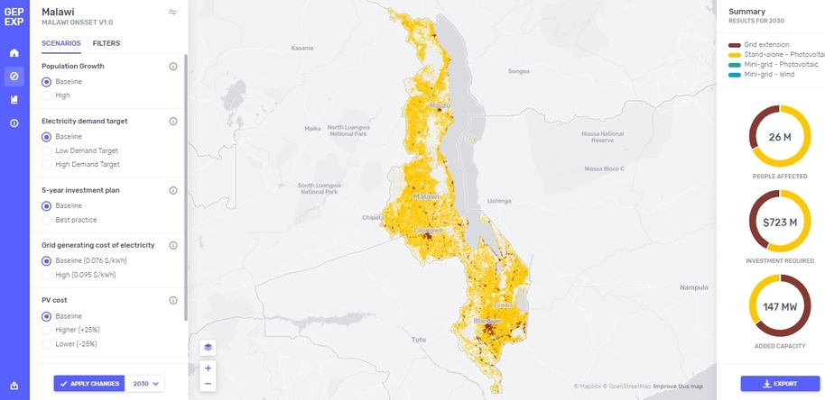
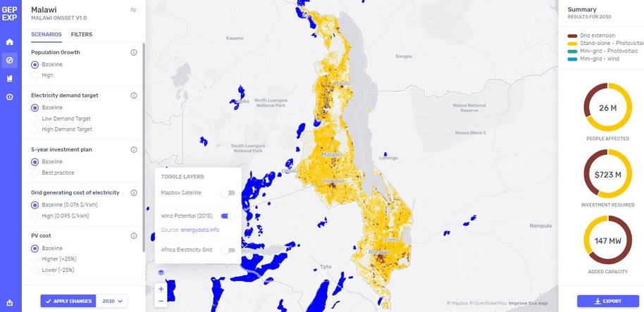

# GEP Explorer

## Access GEP Explorer service [here](http://www.globalelectrificationplatform.com/)

## Overview

The GEP Explorer is an open access, interactive, online platform that allows overview of electrification investment scenarios for a selection of countries. The scenarios present how to achieve universal electricity access in two steps. The first step is an outlook for an intermediate investment strategy (up to 2025). The second is explores full electrification by 2030. The user is able to easily move through 216 scenario combinations to meet the access goals.

GEP Explorer allows customized rendering. The user can also select base maps and other available layers that illustrate the country’s electrification status and overlay them with results from the electrification investment scenarios.

The number, type and parameterization of electrification investment scenarios along with their inherent assumptions are presented in the following slides in the form of 'levers'. In the next phase of the project, both scenarios and assumptions will derive from the annual GEP update.
The process is open to everyone\!

 Note

Informing the 216 electrification investment scenarios was based on two types of data; GIS related and non-GIS related. Both have been collected and cured based on suggested guidelines available [here](https://drive.google.com/file/d/1O3N1vrGJtLEPN4_3_KxJDxqc4cCEo2H9/view?usp=sharing).

 Note

GEP Explorer is open source. That is, it can be configured and used
locally and independently of the online server. More information is
available in the interoperability section.

## Target Audience

The GEP Explorer aims to support first-order engaging discussions
between:

  - High-level country counterparts (politicians, government officials,
    managers)
  - Financiers and Investors
  - Consultants
  - Practitioners
  - NGOs and IGOs

It can also be used to provide investment outlook info for regular
processes. Possible examples include the IEA WEO, WBG GTF, WBG SEAR,
UN-HLPF, EMP-Africa, EMP-Asia Pacific etc.