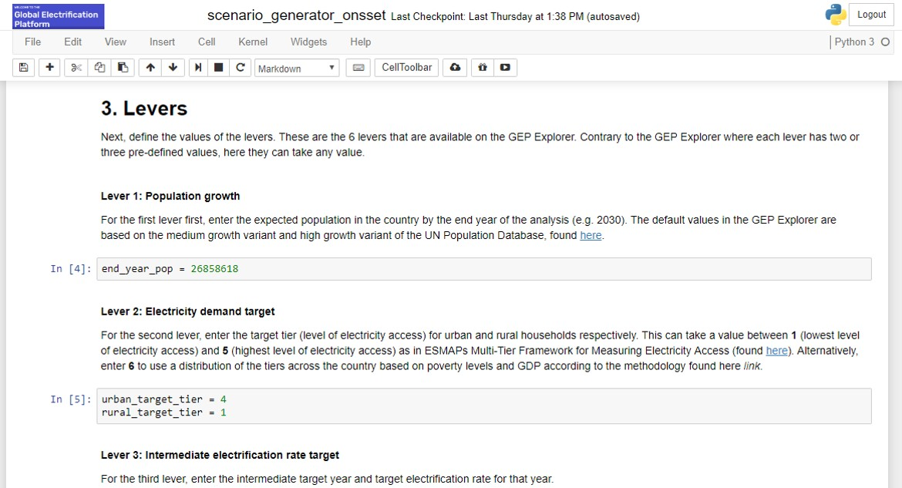
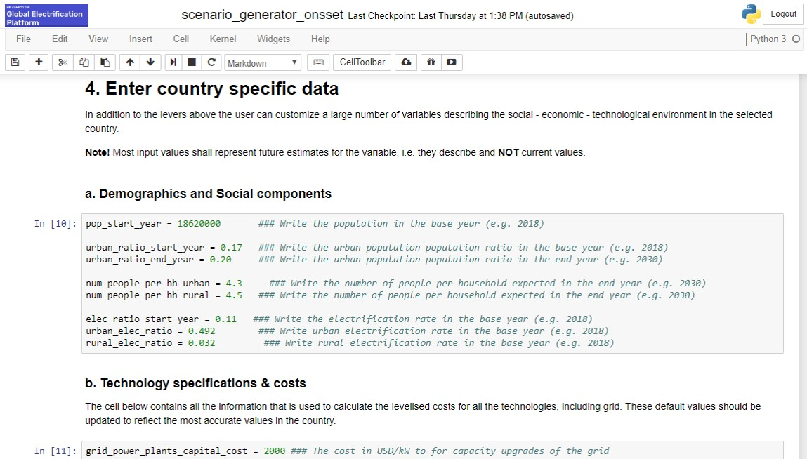

# GEP Generator

## Access GEP Generator services [here](https://github.com/global-electrification-platform/gep-onsset)

## Overview

Replicability and reproducibility are key components of the GEP. The GEP Generator provides policy analysts with a tool to re-generate or modify investment electrification scenarios using an open source, user friendly interface. The GEP Generator is based on the Open Source Spatial Electrification Tool ([OnSSET.org](http://www.onsset.org/)) and is developed as an interactive [Jupyter Notebook](https://jupyter.org/).

The users are able to replicate the electrification investment scenarios available in the GEP Explorer. They can also develop their own scenarios – and visualize them independently. This allows building custom scenarios (~100 interchangeable parameters) that better match local specificities or specific policy measures i.e. borrowing options, technology purchases, formulating concession programs, and subsidies.

 Note

The GEP Generator can be ran locally on the user's computer without any dependency on online servers.

The GEP Generator is still in pilot mode and under development. A fully fledged version is expected to be launched after **OpTIMUS Summer School** in June 2019, Trieste.

## Target Audience 

The GEP Generator aims to support specific key services:

1.  Capacity building activities:
    
    > 1.  Integrated into annual trainings: ICTP Global Summer School /
    >     Energy Modelling Platform(s) to provide a basic introduction
    >     to geo-spatial electrification training.
    > 2.  Implemented in training and outreach with analysts in-country
    >     as part of new and ongoing electrification projects
    > 3.  Become one of several key components in the OpTIMUS.community
    >     global Micro-Masters

2.  Driver of development:
    
    > 1.  Provides analysts with the ability to move beyond pre-cooked
    >     results provided in the GEP Explorer to more nuanced
    >     scenarios. Scenarios that are flexible to conditional national
    >     constraints for goals: developing detailed policy, engaging
    >     with financiers, exploring technology deployment and market
    >     potentials etc.
    > 2.  Being cost-free enables the GEP community to develop first
    >     order electrification plans rapidly at a drastically reduced
    >     cost. These can be used in country engagement activities.